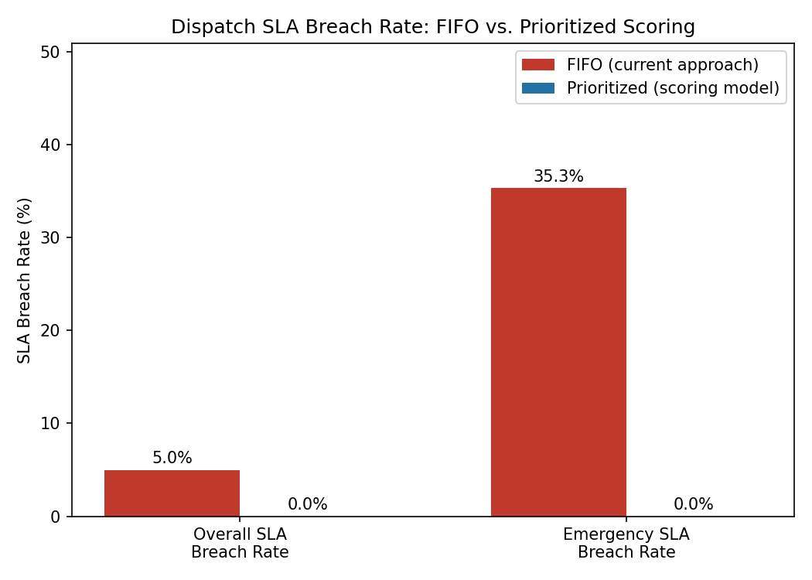

# Dispatch-Prioritization-Tool
A scoring based dispatch prioritization model that replaces first come first served queuing, simulated with Pandas, reduced emergency SLA breaches from 35% to 0%
# Dispatch Prioritization Tool

A small product case study: identifying a real operational problem from dispatch
experience, defining a scoring-based solution, and measuring its impact through
simulation.

## The Problem

In dispatch operations (technician dispatch, patient transport scheduling, etc.),
requests are often served **first-come-first-served (FIFO)**. This feels fair,
but it means an emergency request submitted at 2:00 PM can sit behind ten
low-priority requests submitted earlier in the day, even though the emergency
request has a much tighter SLA window and more at stake if it's delayed.

This is a real pattern I saw firsthand coordinating technician and customer service
dispatcher: urgency and time-sensitivity weren't factored into queue order,
only submission time.

## The Approach

Instead of FIFO, requests are scored on three factors and the **highest-scoring
waiting request** is assigned whenever a technician becomes free:

```
priority_score = 0.5 × urgency_score + 0.3 × sla_risk_score + 0.2 × proximity_score
```

**Why these weights?** (the actual product decision):
- **Urgency (50%)** — the dominant factor. An emergency request should almost
  always jump the queue ahead of a low-priority one; this is how real dispatch
  triage works.
- **SLA risk (30%)** — even a "standard" request that's about to breach its
  window deserves a boost, so nothing quietly expires while emergencies are
  handled.
- **Proximity (20%)** — a minor tiebreaker. All else being equal, serve the
  closer request first to keep the overall queue moving faster.

These weights are tunable — a real deployment would validate them against
actual SLA outcomes and adjust based on what the business cares about most
(e.g., a company more sensitive to average wait time than SLA breaches might
weight proximity higher).

## The Simulation

Rather than just sorting a spreadsheet, this models how dispatch actually
works: requests **arrive over time** (not all at once), and whenever one of
6 technicians becomes free, they pull the next job from whoever is currently
waiting — under either policy:

- **FIFO**: earliest-submitted waiting request goes next.
- **Prioritized**: highest-scoring waiting request goes next.

This event-driven approach avoids a common mistake with these kinds of
analyses — sorting the *entire* day's requests upfront, which isn't how a
live queue behaves.

## Results (120 simulated requests, 6 technicians, 8-hour shift)

| Metric                     | FIFO   | Prioritized |
|-----------------------------|--------|-------------|
| Overall SLA breach rate     | 5.0%   | 0.0%        |
| Emergency SLA breach rate   | 35.3%  | 0.0%        |



**Emergency SLA breaches dropped from 35.3% to 0%** by re-ordering the queue
based on urgency, time pressure, and distance — with no tradeoff in the
overall breach rate, which also improved.

## Files

- `generate_data.py` — creates a realistic sample dataset of dispatch requests
- `prioritize.py` — scoring logic + event-driven dispatch simulation
- `make_chart.py` — generates the comparison chart
- `sample_requests.csv` — the generated dataset used for this run
- `fifo_results.csv` / `prioritized_results.csv` — per-request simulation output

## What I'd Do Next (Given Real Data)

- Validate the weight assumptions (0.5 / 0.3 / 0.2) against real historical
  SLA outcomes rather than my own judgment.
- Add a "starvation guard" so a low-priority request never waits indefinitely
  just because urgent requests keep arriving.
- Test sensitivity to team size — the improvement shown here assumes 6
  technicians; the tradeoffs would look different with a smaller or larger team.

## Why I Built This

This started from a real pattern I noticed doing dispatch coordination work:
prioritization was manual and reactive rather than structured. This project
is my attempt to formalize that instinct into a measurable, defensible model —
the same kind of thinking I'd want to bring to prioritization decisions as a
Product Manager.
